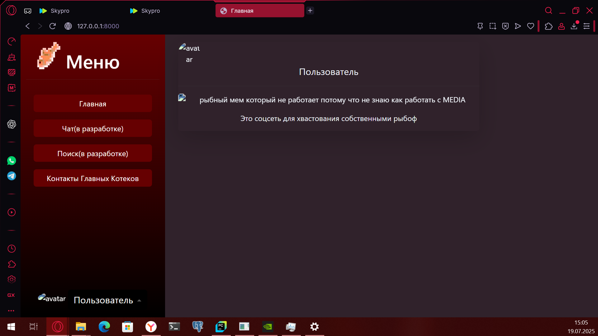

Вот минимальный, но содержательный `README.md` для твоего проекта **Fishgramm** на Django:

---


# Fishgramm — рыбо-социальная сеть на Django

Fishgramm — это мини-блог о рыбах, где можно делиться "постами" на главной странице и оставлять заявки через форму обратной связи.

## Возможности

- Главная страница с постами
- Контактная форма с поддержкой POST-запросов
- Статичные и медиа-файлы (картинки, стили, JS)
- ⚙Реализовано на Django 5+

## Установка

1. Клонируй репозиторий:

```bash
git clone https://github.com/твой-юзернейм/fishgramm.git
cd fishgramm
```

2. Создай виртуальное окружение:

```bash
python -m venv .venv
source .venv/bin/activate  # или .venv\Scripts\activate на Windows
```

3. Установи зависимости:

```bash
pip install -r requirements.txt
```

4. Запусти сервер:

```bash
python manage.py runserver
```

## Структура проекта

```
fishgramm/                             # Корневая папка проекта
│
├── blog/                              # Основное Django-приложение
│   ├── migrations/                    # Миграции базы данных
│   ├── templates/                     # HTML-шаблоны
│   │   ├── contacts.html              # Шаблон контактной страницы
│   │   └── home.html                  # Шаблон главной страницы    
│   ├── __init__.py
│   ├── admin.py                       # Регистрация моделей в админке
│   ├── apps.py                        # Конфигурация приложения
│   ├── models.py                      # Модели базы данных
│   ├── tests.py                       # Тесты
│   ├── urls.py                        # Маршруты приложения blog
│   └── views.py                       # Контроллеры (представления)
│
├── fishgramm/                         # Конфигурация Django-проекта
│   ├── __init__.py
│   ├── asgi.py
│   ├── settings.py                    # Настройки Django
│   ├── urls.py                        # Глобальные маршруты
│   └── wsgi.py
│
├── media/                             # Медиафайлы, загружаемые пользователями
│   ├── avatars/                       # Аватары пользователей
│   └── contents/                      # Контент постов
│       └── image/
│
├── static/                            # Статические файлы (Bootstrap, иконки, JS)
│   ├── css/                           # Стили
│   ├── icons/                         # Иконки (логотип, аватар)
│   └── js/                            # JavaScript
│
├── .venv/                             # Виртуальное окружение
├── db.sqlite3                         # SQLite база данных (по умолчанию)
├── manage.py                         # Утилита управления Django
├── requirements.txt                  # Зависимости проекта
└── README.md                         # Документация проекта

```

## Контакты

Форма обратной связи находится на странице `contacts/`
Можно отправить POST-запрос, и данные будут обработаны сервером.

## Скриншот



---

## Используемые технологии

* Python 3.13
* Django 5.2+
* HTML5 + Bootstrap


